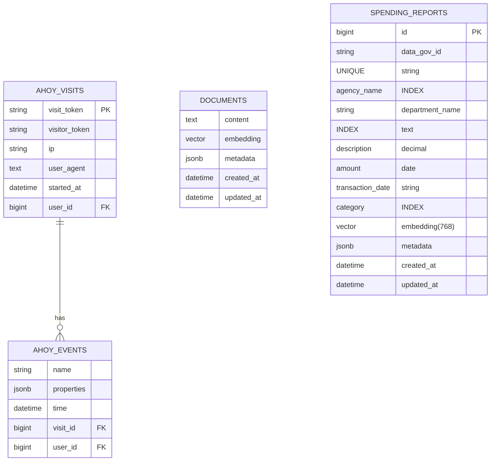

# Database Schema Plan

## Entity Relationship Diagram (ERD)



## Table Definitions

### ahoy_visits
| Column | Type | Constraints | Description |
|--------|------|-------------|-------------|
| id | bigint | PK | Primary key |
| visit_token | string | UNIQUE | Unique token for a visit |
| visitor_token | string | | Unique token for a visitor |
| user_id | bigint | FK (Users) | Reference to the user who made the visit (optional) |
| ip | string | | IP address of the visitor |
| user_agent | text | | User agent string of the browser |
| referrer | text | | Referrer URL |
| referring_domain | string | | Domain of the referrer |
| landing_page | text | | First page visited in the session |
| browser | string | | Browser name |
| os | string | | Operating system |
| device_type | string | | Device type (e.g., desktop, mobile) |
| country | string | | Country of the visitor |
| region | string | | Region/State of the visitor |
| city | string | | City of the visitor |
| latitude | float | | Latitude of the visitor |
| longitude | float | | Longitude of the visitor |
| utm_source | string | | UTM source parameter |
| utm_medium | string | | UTM medium parameter |
| utm_term | string | | UTM term parameter |
| utm_content | string | | UTM content parameter |
| utm_campaign | string | | UTM campaign parameter |
| app_version | string | | Application version |
| os_version | string | | Operating system version |
| platform | string | | Platform (e.g., web, iOS, Android) |
| started_at | datetime | | Timestamp when the visit started |

### ahoy_events
| Column | Type | Constraints | Description |
|--------|------|-------------|-------------|
| id | bigint | PK | Primary key |
| visit_id | bigint | FK (Ahoy::Visit) | Reference to the visit |
| user_id | bigint | FK (Users) | Reference to the user (optional) |
| name | string | | Name of the event |
| properties | jsonb | | JSONB hash of event properties |
| time | datetime | | Timestamp when the event occurred |

### documents
| Column | Type | Constraints | Description |
|--------|------|-------------|-------------|
| id | bigint | PK | Primary key |
| content | text | | The text content of the document |
| embedding | vector | limit: 768 | Vector embedding of the content for semantic search |
| metadata | jsonb | | Additional JSON metadata associated with the document |
| created_at | datetime | NOT NULL | Timestamp when the record was created |
| updated_at | datetime | NOT NULL | Timestamp when the record was last updated |

### spending_reports
| Column | Type | Constraints | Description |
|--------|------|-------------|-------------|
| id | bigint | PK | Primary key |
| data_gov_id | string | UNIQUE, INDEX | Unique ID from the Data.gov API, if available |
| agency_name | string | INDEX | The name of the government agency |
| department_name | string | INDEX | The specific department within the agency |
| description | text | NOT NULL | The raw line-item description of the expenditure |
| amount | decimal | NOT NULL | The monetary amount of the expenditure |
| transaction_date | date | NOT NULL | The date of the transaction |
| category | string | INDEX | AI-assigned category for the expenditure (e.g., "Personnel", "Infrastructure") |
| embedding | vector | limit: 768 | Vector embedding of the description for semantic search |
| metadata | jsonb | | Raw JSON data from the API, stored for completeness |
| created_at | datetime | NOT NULL | Timestamp when the record was created |
| updated_at | datetime | NOT NULL | Timestamp when the record was last updated |
```