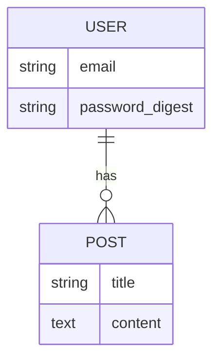

# Database Schema Plan

## Entity Relationship Diagram (ERD)
<!-- TODO: Add Mermaid ER Diagram here -->

## Table Definitions

### Users
| Column | Type | Constraints | Description |
|--------|------|-------------|-------------|
| id     | uuid | PK          |             |
| email  | string| unique, index|             |

<!-- TODO: Add planned tables here before generating migrations -->
