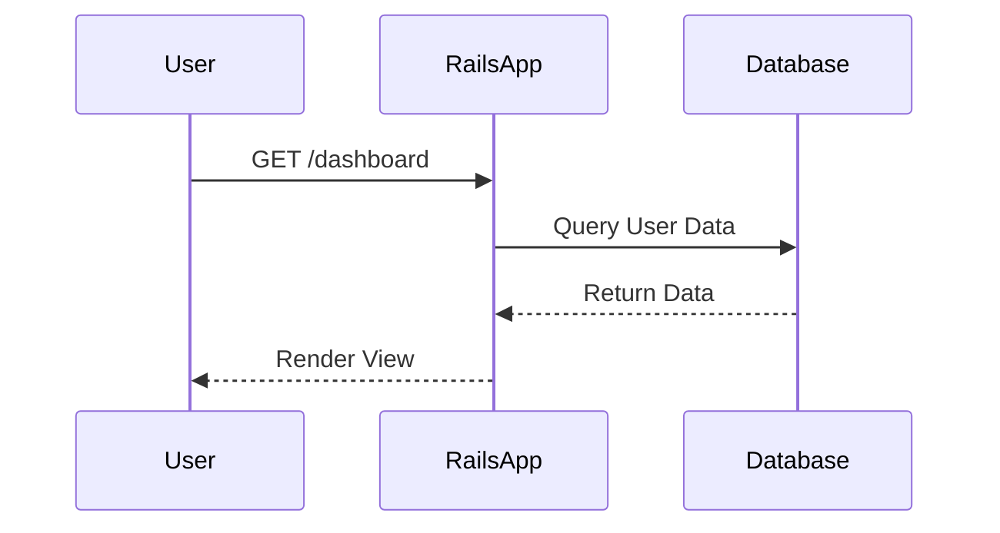

# UML Sequence Diagrams

Use [Mermaid.js](https://mermaid.js.org/syntax/sequenceDiagram.html) syntax to document complex logic.

## Critical Paths
<!-- TODO: Add sequence diagrams for critical paths (e.g., User Signup, Payment Flow, AI RAG Pipeline). -->

### Example: Basic Flow

